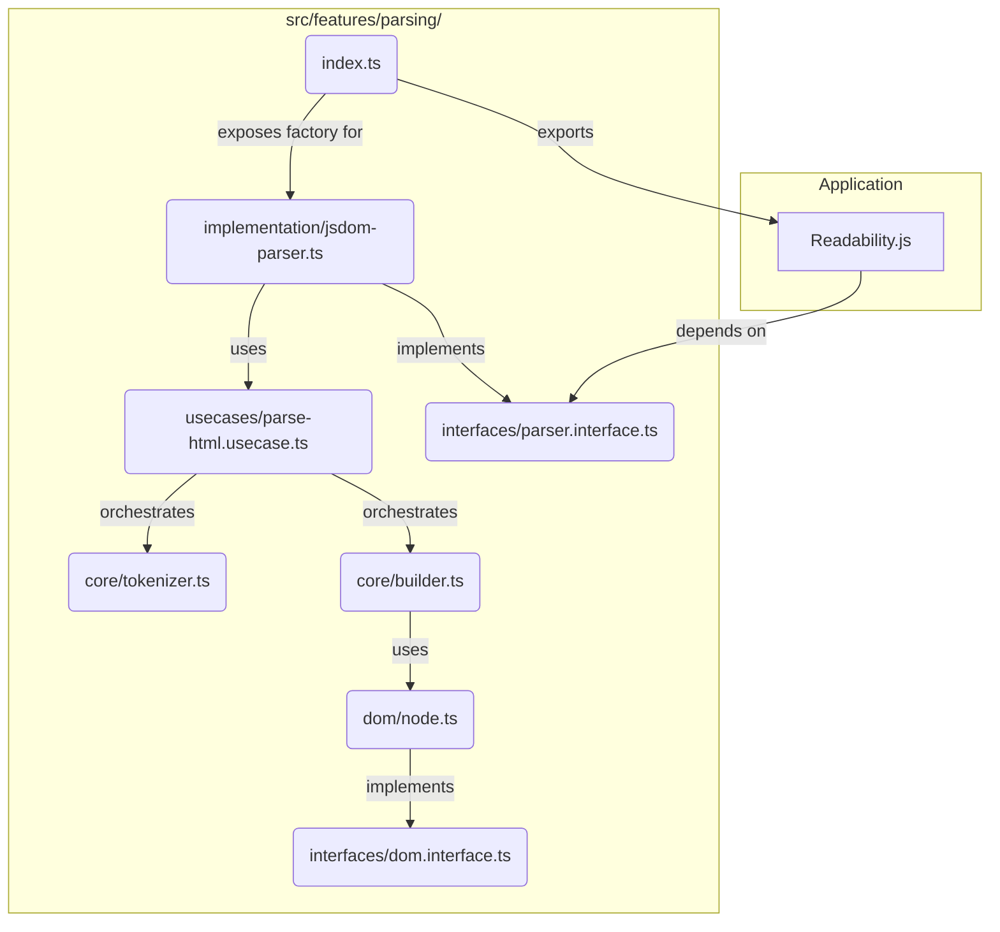

# JSDOMParser.js Modernization Plan

## Executive Summary

This document outlines a comprehensive plan to modernize the legacy `JSDOMParser.js` from a monolithic, hard-to-maintain script into a modular, type-safe, and testable feature that aligns with modern architectural principles. The modernization will address critical issues in maintainability, testability, and reusability while establishing a foundation for future development.

## Current State Analysis

### Core Problems

A thorough analysis of the existing `JSDOMParser.js` reveals several critical issues that hinder development and maintenance:

| Problem Area | Description | Impact |
| :--- | :--- | :--- |
| **Monolithic Structure** | The entire parser, including custom DOM implementation and parsing logic, is contained within a single, large IIFE | Difficult to navigate, understand, and modify |
| **Lack of Type Safety** | Written in plain JavaScript without type definitions | Ambiguous data structures, increased runtime errors, unsafe refactoring |
| **Poor Testability** | Tight coupling and lack of clear module boundaries | Unit testing extremely difficult, hard to test individual components |
| **Tight Coupling** | Explicitly designed for `Readability.js` with hardcoded assumptions | Prevents reuse, makes independent evolution difficult |
| **Legacy Patterns** | Uses outdated JavaScript practices (prototype-based inheritance, `var`, `__proto__`) | Reduced readability and maintainability |

### Technical Debt Assessment

The current implementation suffers from:
- **Prototype-based "classes"** using verbose `Element.prototype = { ... }` syntax
- **IIFE wrapper** with conditional `module.exports` for module management
- **Global namespace pollution** through object attachment
- **Inconsistent variable declarations** using `var` throughout
- **Manual object/array manipulation** without modern syntax features

## Modernization Strategy

### Architectural Principles

Our modernization approach is grounded in established architectural principles:

| Principle | Application | Benefit |
| :--- | :--- | :--- |
| **Separation of Concerns** | Decompose monolith into focused modules | Improved maintainability and understanding |
| **Feature-based Architecture** | Organize by parsing functionality rather than technical layers | Better cohesion and discoverability |
| **Dependency Inversion** | Depend on abstractions, not concrete implementations | Flexibility and testability |
| **Type Safety** | Explicit contracts through TypeScript interfaces | Compile-time error detection |
| **Test-Driven Development** | TDD approach for all new modules | Quality assurance and design validation |

### Solution Mapping

| Problem | Solution | Implementation |
| :--- | :--- | :--- |
| Monolithic Structure | **Modularization** | Feature-based directory structure with focused modules |
| Lack of Type Safety | **TypeScript Adoption** | Complete rewrite with strict typing and interfaces |
| Poor Testability | **TDD & Dependency Injection** | Testable modules with injected dependencies |
| Tight Coupling | **Interface Abstraction** | Generic `IParser` interface with concrete implementations |
| Legacy Patterns | **Modern JavaScript/TypeScript** | ES6+ classes, modules, and syntax |

## Technical Implementation Plan

### 1. Type Safety with TypeScript

**Objective**: Eliminate runtime type errors and improve code reliability.

**Implementation**:
- **Explicit Typing**: All variables, parameters, and return values receive explicit types
- **Interface Definitions**: Custom interfaces for core structures (`INode`, `IElement`, `IDocument`)
- **Compile-time Validation**: TypeScript compiler catches type-related bugs during development
- **Generic Contracts**: Clear "contracts" defining object capabilities and requirements

**Example**:
```typescript
interface IParser {
  parse(html: string): Result<IDocument, ParseError>;
}

interface IElement extends INode {
  tagName: string;
  attributes: Map<string, string>;
  children: INode[];
}
```

### 2. Modern Class Architecture

**Objective**: Replace prototype-based patterns with modern, maintainable class structures.

**Implementation**:
- **ES6 Classes**: Convert all prototype-based structures to `class` syntax
- **Interface Implementation**: Classes implement well-defined interfaces
- **Clear Inheritance**: Explicit inheritance relationships using `extends`
- **Encapsulation**: Proper access modifiers and method organization

**Example**:
```typescript
class Element extends Node implements IElement {
  constructor(
    public readonly tagName: string,
    attributes: Map<string, string> = new Map()
  ) {
    super();
    this.attributes = attributes;
  }
}
```

### 3. ES Module System

**Objective**: Replace IIFE pattern with standard module system for better organization.

**Implementation**:
- **Import/Export Syntax**: Standard ES module imports and exports
- **Explicit Dependencies**: Clear dependency declarations between modules
- **Namespace Management**: Elimination of global object pollution
- **Tree Shaking Support**: Enable modern build tool optimizations

### 4. Modern JavaScript Features

**Objective**: Leverage contemporary language features for cleaner, more maintainable code.

**Implementation**:
- **Block Scoping**: Replace `var` with `let`/`const`
- **Destructuring**: Clean property and array element extraction
- **Spread Syntax**: Immutable patterns for object/array operations
- **Arrow Functions**: Concise function expressions where appropriate
- **Template Literals**: Improved string interpolation and formatting

## Architecture Design

### Module Organization

Following feature-based architecture principles, the parser will be organized under `src/features/parsing/`:

```
src/
└── features/
    └── parsing/
        ├── index.ts                    # Public API factory
        ├── interfaces/                 # Abstract contracts
        │   ├── parser.interface.ts     # IParser, IResult definitions
        │   └── dom.interface.ts        # INode, IElement, IDocument
        ├── usecases/                   # Business logic orchestration
        │   └── parse-html.usecase.ts   # Main parsing workflow
        ├── core/                       # Pure parsing logic
        │   ├── tokenizer.ts            # HTML tokenization
        │   └── builder.ts              # DOM tree construction
        ├── dom/                        # DOM implementation
        │   ├── index.ts                # DOM exports
        │   ├── node.ts                 # Base node implementation
        │   ├── element.ts              # Element implementation
        │   └── document.ts             # Document implementation
        └── implementation/             # Concrete parser
            └── jsdom-parser.ts         # Main parser class
```

### Dependency Flow



### Interface Design

**Core Interfaces**:
- `IParser`: Main parsing contract
- `IDocument`: Document representation
- `IElement`: Element node contract
- `INode`: Base node interface
- `Result<T, E>`: Type-safe error handling

## Expected Outcomes

### Quality Improvements
- **Type Safety**: Compile-time error detection eliminates entire classes of runtime bugs
- **Maintainability**: Modular structure makes code easier to understand and modify
- **Testability**: Dependency injection enables comprehensive unit testing
- **Reusability**: Generic interfaces allow parser use in other contexts

### Development Benefits
- **Faster Development**: Better tooling support and IntelliSense
- **Safer Refactoring**: Type system prevents breaking changes
- **Improved Debugging**: Clear module boundaries and type information
- **Better Documentation**: Types serve as living documentation

### Performance Considerations
- **Bundle Size**: Tree shaking eliminates unused code
- **Runtime Performance**: Modern JavaScript features and optimizations
- **Memory Usage**: Better object lifecycle management
- **Parsing Speed**: Optimized tokenization and tree building algorithms

## Success Criteria

1. **Functional Parity**: New parser produces identical results to legacy version
2. **Performance Maintenance**: No significant performance regression
3. **Test Coverage**: >90% code coverage with comprehensive test suite
4. **Type Safety**: Zero TypeScript compilation errors
5. **Documentation**: Complete API documentation and usage examples
6. **Integration**: Seamless integration with existing Readability.js workflow

## Conclusion

This modernization plan transforms the legacy `JSDOMParser.js` into a maintainable, type-safe, and testable feature that aligns with modern development practices. The structured approach ensures minimal disruption while delivering significant improvements in code quality, developer experience, and long-term maintainability.

The investment in modernization will pay dividends through reduced debugging time, safer refactoring capabilities, and a foundation that supports future enhancements and optimizations.